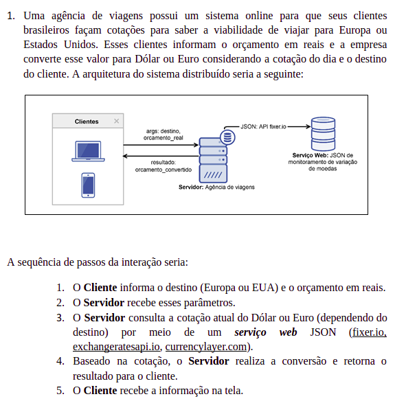
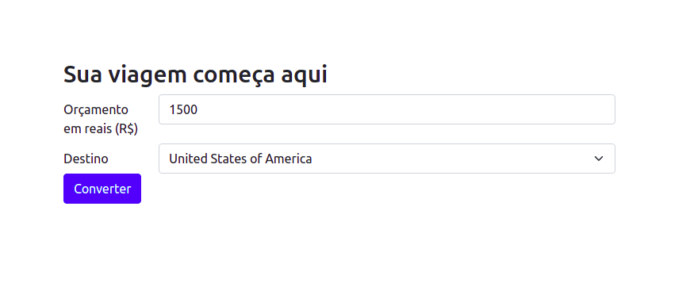
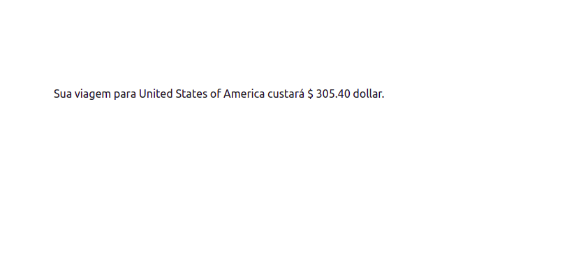
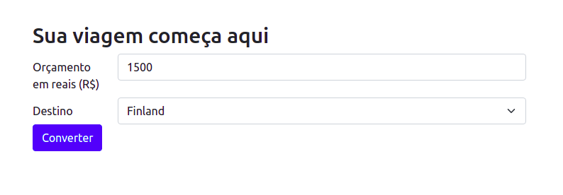

Projeto feito para faculdade.

APIs utilizadas:
1. https://restcountries.eu/ (informações de países)
2. https://www.exchangerate-api.com/ (conversão de moedas)

Disciplina: Sistemas distribuídos.
Prof: Jean

Resultado:

Dollar

Euro

